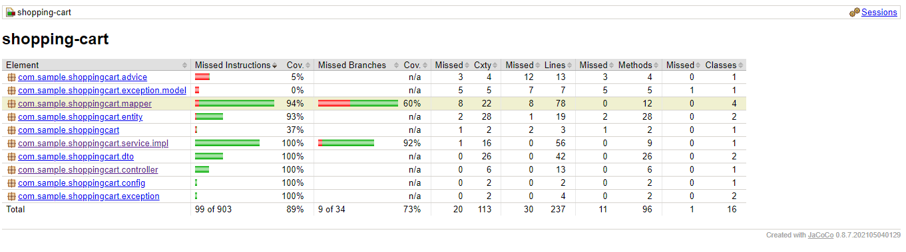

# SHOPPING CART ASSIGNMENT

## Requirements

For building and running the application you need:

- [JDK 11](https://docs.aws.amazon.com/corretto/latest/corretto-11-ug/windows-info.html)
- [Maven 3](https://maven.apache.org)
- [Postgres](https://www.postgresql.org/download/)

## Running the application locally

#### Configuring Database

Please create database in postgres and modify these properties in application.properties before running the app.
```sh
spring.datasource.url=jdbc:postgresql://localhost:5432/shopping
spring.datasource.username=postgres
spring.datasource.password=password
```
#### Running the App
There are several ways to run a Spring Boot application on your local machine. One way is to execute the `main` method in the `com.sample.shoppingcart.ShoppingCartApplication` class from your IDE.

Alternatively you can use the [Spring Boot Maven plugin](https://docs.spring.io/spring-boot/docs/current/reference/html/build-tool-plugins-maven-plugin.html). For example :

```sh
mvn spring-boot:run
```
- App will be started on specific port (8080)

#### Code Coverage
- Coverage folder will be created after running below command.

```sh
mvn clean package
```
- And coverage report will be generated on this path "target\site\jacoco\index.html"
- index.html can be opened to see coverage in browser.

#### Swagger
- Swagger Api documentation can be accessed on url : http://localhost:8080/swagger-ui/

#### Technologies used

* [Java]
* [Spring Boot]
* [Postgres]
* [MapStruct]
* [Jacoco]
* [JUnit]
* [Maven]

### Futher points

- Current code is created keeping in mind the possible hypothetical scenarios.
- Code is designed for futher modification as application scope grows.

### Screenshots



